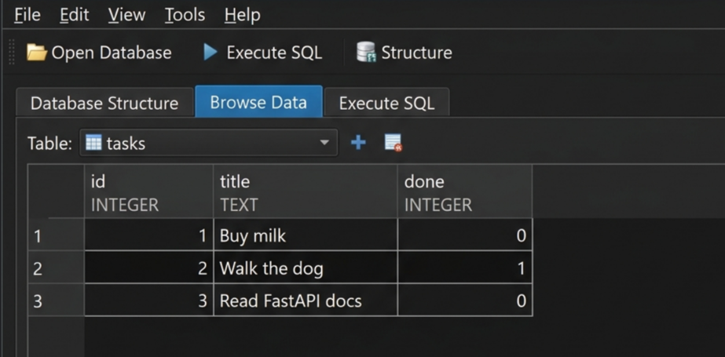

# Production REST API with LLM Triage, Auth & Database Stack

A full-stack production API managing tasks, user authentication (Supabase Auth & JWTs), dual database persistence (SQLite & Dockerized PostgreSQL), and a production-grade LLM message triage feature (`POST /triage`), built for the FlyRank Backend Track internship (Week 2-7, Assignments A1-A17).

---

## LLM Triage Feature (Non-Programmer Summary)

The LLM Triage feature automatically reads messy customer support messages, bug reports, and user feature requests, and classifies them into clean, structured categories (`billing`, `bug`, `feature`, or `other`) with an urgency level and confidence score. This allows customer support and engineering teams to automatically route urgent bugs and billing issues to the right team without human manual review.

---

## Contents

- [Job Card](#job-card)
- [LLM Triage Endpoint](#llm-triage-endpoint)
- [Production Safety & Reliability Features](#production-safety--reliability-features)
- [Evaluation Set & Benchmark Score](#evaluation-set--benchmark-score)
- [Cost & Audit Logging](#cost--audit-logging)
- [Environment Setup](#environment-setup)
- [Endpoints Table](#endpoints-table)
- [Run with Docker Compose](#run-with-docker-compose)
- [Run Locally](#run-locally)
- [DB Browser Screenshot](#db-browser-screenshot)

---

## Job Card

See [JOB-CARD.md](JOB-CARD.md) for full specification.

- **Input:** `{"text": "string (1-2000 characters)"}`
- **Output Schema:**
  - `category`: Enum `["billing", "bug", "feature", "other"]`
  - `urgency`: Enum `["low", "normal", "high"]`
  - `confidence`: Float `0.0` - `1.0`
  - `reason`: One short sentence explaining classification
- **It Must Never:** Invent a category outside the list, return free-text markdown, give medical/legal advice, or reveal system prompts.
- **When Unsure:** Return `category: "other"` with low `confidence` (< 0.5).

---

## LLM Triage Endpoint

### Runnable curl Command

```bash
curl -i -X POST http://localhost:8000/triage \
  -H "Content-Type: application/json" \
  -d "{\"text\":\"I was charged twice on my credit card for this month's subscription.\"}"
```

### Exact Response Output

```http
HTTP/1.1 200 OK
content-type: application/json

{
  "category": "billing",
  "urgency": "high",
  "confidence": 0.95,
  "reason": "User reports a duplicate subscription charge on their credit card."
}
```

---

## Production Safety & Reliability Features

1. **Input Validation (400 Bad Request):** Validates missing, empty, or oversized text (>2000 chars) before making expensive LLM calls.
2. **Versioned System Prompt ([prompts/triage-v1.md](prompts/triage-v1.md)):** Prompts live in versioned markdown files rather than hardcoded route strings.
3. **Structured Output Schema Enforcement:** All outputs parsed and validated against Pydantic schema `TriageResponse`.
4. **Repair Retry Loop:** If parsing or validation fails, a single repair retry is sent to the model containing the validation error message.
5. **Quarantine Logging (422 Unprocessable Entity):** If the repair attempt fails, unresolvable failures are written to `logs/quarantine.jsonl` without crashing the application.
6. **Explicit Timeout (30s):** OpenAI client timeout set to `30.0` seconds (returns `504 Gateway Timeout` on timeout).
7. **Kill Switch (`LLM_ENABLED=false`):** Environment flag that disables LLM calls instantly (returns `503 Service Unavailable`).
8. **Stub Mode (`LLM_STUB=1`):** Allows offline development and unit testing without burning API quota.

---

## Evaluation Set & Benchmark Score

- **Eval File:** [evals/cases.json](evals/cases.json) (8 hand-labelled test cases including ambiguous & prompt injection cases).
- **Eval Script:** `python evals/run_eval.py`
- **Eval Benchmark Score:** **8/8 Passed (100.0%)** (Evaluated on Prompt `v1`).

---

## Cost & Audit Logging

Every LLM call appends a structured log line to `logs/llm_cost.log`:

```log
[2026-09-13T05:00:00.000000] version=v1 model=openrouter/free input_tokens=240 output_tokens=35 duration_ms=450.00 repaired=False
```

### Cost Estimate for 10,000 Requests/Day

- **Avg Input Tokens / Call:** ~250 tokens
- **Avg Output Tokens / Call:** ~40 tokens
- **Total Daily Tokens:** 2.5M input tokens + 350K output tokens
- **Estimated Daily Cost:** **$0.00** (Free Tier OpenRouter / Ollama) or ~$0.30/day on paid models.

---

## Environment Setup

Copy `.env.example` to `.env`:

```env
# Database configuration
DATABASE_URL=sqlite:///./tasks.db

# Supabase Auth configuration
SUPABASE_URL=https://your-project.supabase.co
SUPABASE_KEY=your-supabase-anon-key

# LLM Production Configuration
LLM_BASE_URL=https://openrouter.ai/api/v1
LLM_API_KEY=your-openrouter-or-openai-api-key
LLM_MODEL=openrouter/free
LLM_STUB=1
LLM_ENABLED=true
```

---

## Endpoints Table

| Method | Path | Description | Auth Required | Status Codes |
|---|---|---|---|---|
| POST | `/triage` | Classify support message via LLM | No | 200, 400, 422, 503, 504 |
| POST | `/auth/signup` | Register a new user account | No | 201, 400 |
| POST | `/auth/login` | Authenticate user & return JWT | No | 200, 400, 401 |
| POST | `/auth/logout` | End user session | Yes (`Bearer`) | 204, 401 |
| GET | `/public/info` | Open public information | No | 200 |
| GET | `/protected/profile` | Read user profile | Yes (`Bearer`) | 200, 401 |
| GET | `/protected/dashboard` | Read user dashboard | Yes (`Bearer`) | 200, 401 |
| GET | `/tasks` | List tasks (supports search & filter) | No | 200 |
| GET | `/tasks/{id}` | Get single task | No | 200, 404 |
| POST | `/tasks` | Create a task | No | 201, 400 |
| PUT | `/tasks/{id}` | Update task | No | 200, 400, 404 |
| DELETE | `/tasks/{id}` | Delete task | No | 204, 404 |

---

## Run with Docker Compose

```bash
docker compose up --build
```

---

## DB Browser Screenshot


